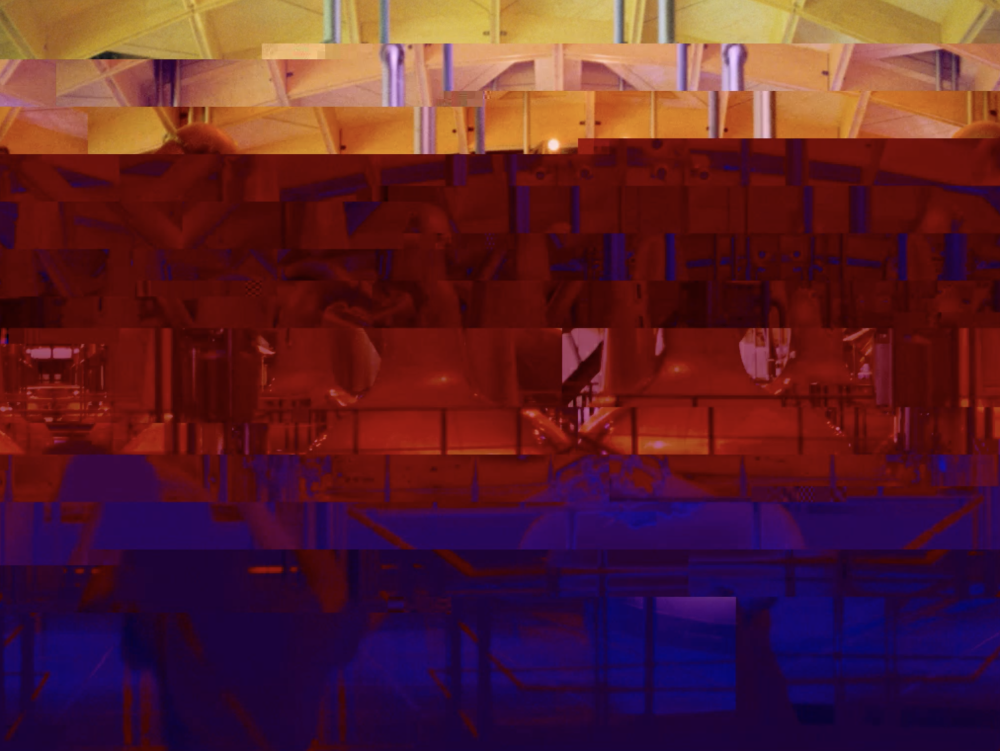

# ReMenkman

## MIT Media Lab - Recreating the Past - Class 9: Rosa Menkman

The MIT Media Lab class - Recreating the Past - explores a number of influential artists who have, over the past century, added their own unique perspective on computational art. Each week focuses on a new artist and through exploring their view point and recreating their artworks I hope to gain a valuable window into their thought processes, helping me learn how to express my own opinions through computational art. 

## Rosa Menkman

Rosa Menkman is reknown for her work in the field of glitch and has leveraged the concept of glitch to create some truly outstanding pieces of artwork. For the purposes of Recreating the Past the idea of glitch was focused around file formats, specifically JPG which as a robust compression format can be pushed to the extreme before becoming corrupted and unreadable. As such I decided to spend this week experimenting and playing with JPG files rather than trying to recreate any specific style or piece.

## Lofi JPG Bend

Original             |  Recreation
:-------------------------:|:-------------------------:
 |   

#### Recreation

#### Process

There was less of a focus on process this week as there was trial and error and unpicking what effects I could create through various file destruction techniques. To begin with this was simple replacing random pieces of the JPG data structure with blanks - repeatedly eating away at the file integrity. This created an interesting effect but it was a little too linear in that it only shifted the image in one direction - a right skew with increasinging numbers of vertical splits.

Destroying a single file proved to be fun but I felt that it might be more conceptually interesting to try to morph between two different JPG files by interspersing their data, with an aim to make it feel like one file was eating away at the other. The simplest method for doing this was to progressively replace the end pixels of the source image with the target image so that through time the new image would appear from the end. Again this felt too linear though.

To overcome this I first tried to change pixels from both the beginning of the image and the end of the image simulaneously so that the original image would be shrunk down to the center. This effect also felt a little flat and lacked energy though.

The real breakthrough came with the use of the modulus operator. Instead of the target image eating away at the source from the end or from the beginning, every Nth byte would instead be replaced. In order to iterate through the Nth byte I utilized the modulus operator (starting from 500,000 so that every 500,000th byte would be swapped). By reducing the modulus number from 500,000 all the way down to 2 created a non-linear glitch process which accelerates through the image. The effect it produces feels very frantic and rushed which helps create the feeling of the image being eaten away at. The new image is then phased in through the reverse approach so the transition between the two is somewhat smoothed. This results in the final piece below.

